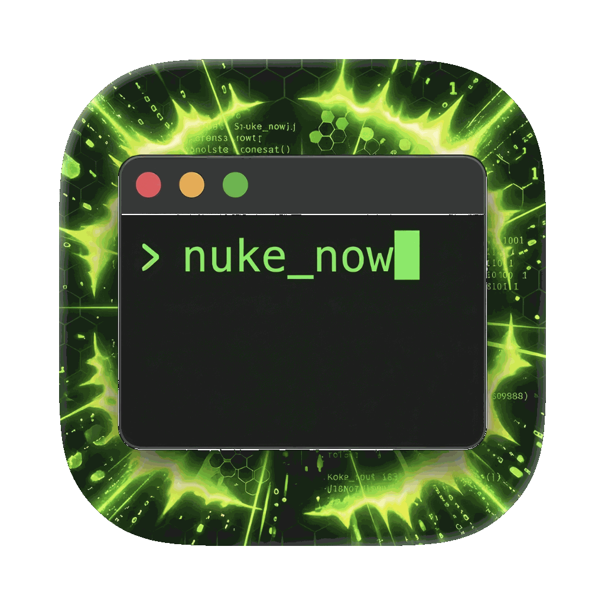
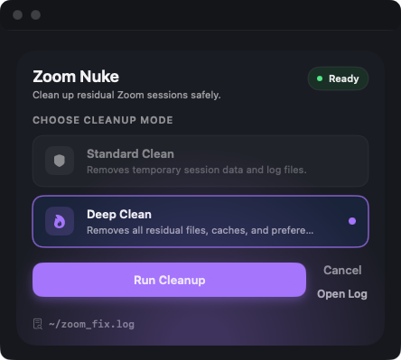

# 🔥 macOS Zoom Nuke & Reinstall Tool

<p align="center">
  
</p>

> **"Ben from IT" approved Zoom cleanup and reinstallation script for macOS**

## 📸 Screenshot

<p align="center">
  
</p>

## 📋 Overview

`zoom_nuke_overkill.sh` is a comprehensive macOS script that completely removes Zoom and all associated data, clears hardware fingerprints, spoofs network identifiers, and performs a clean reinstall. This tool is useful for:

- **Privacy-conscious users** who want to remove all Zoom tracking data
- **IT professionals** performing system cleanup
- **Users experiencing Zoom issues** requiring a complete reset
- **Security researchers** testing Zoom's data persistence

## 🚀 Features

### Core Functionality
- **Complete Zoom Removal**: Kills all processes and removes the app + all user data
- **Hardware Fingerprint Clearing**: Removes system identifiers and caches
- **MAC Address Spoofing**: Attempts to change network interface MAC using cryptographically strong randomness
- **Network Cache Flushing**: Clears DNS and network-related caches
- **Fresh Installation**: Downloads and installs the latest Zoom from the official source with package signature verification

### Advanced Features
- **Restore Mode** (`--restore`): Interactively restore a previous backup
- **Audit Mode** (`--audit`): Generate a non-destructive report of Zoom's current state
- **Deep Clean Mode** (`--deep-clean`): Additional removal of residual artifacts (see warnings)
- **Hardware Protection Script**: Installs `~/.zoom_protection.sh` that spoofs the system hostname each time Zoom is launched, restoring it on exit
- **Comprehensive Logging**: All operations are written to `~/zoom_fix.log`
- **Backup Creation**: Backs up all removed data to a timestamped directory before deletion

### Safety Features
- **Confirmation Prompts**: User confirmation before destructive operations, with explicit listing of what deep-clean will touch
- **Single Version Source**: Version is read from `VERSION` at build and runtime — no more version drift
- **Error Handling**: ERR trap correctly deferred until after sourcing, so early failures are caught
- **Disk Space Check**: Validates 500 MB free before starting
- **Package Integrity Verification**: `pkgutil --check-signature` and size check before `sudo installer`
- **Stale Backup Detection**: MAC backup file stores interface name + format version; stale/mismatched entries are rejected rather than silently applied

## 🛠️ Requirements

### System Requirements
- **macOS 10.15+** (Catalina or later)
- **Disk Space**: Minimum 500 MB available
- **Network**: Internet connection for Zoom download
- **Permissions**: Administrator privileges (sudo access)

### Required Tools
The script checks for these at startup:
- `sudo`, `curl`, `openssl`, `networksetup`, `pkgutil`, `system_profiler`

## 📖 Usage

### Non-Technical Quick Start (Recommended)

1. Download `Zoom-Nuke-macOS-<version>.zip` from the latest GitHub release.
2. Open the zip and double-click `Zoom Nuke.app`.
3. Choose `Standard Clean` or `Deep Clean`.
4. Click `Run Cleanup` — the GUI shows live output directly in the window (no Terminal window opens).
5. Enter your Mac password when prompted inside the app.
6. If macOS blocks the app on first launch, right-click `Zoom Nuke.app` → **Open** → **Open**.

> The app runs the script in-process and streams live output to the built-in log view. No Terminal window or AppleScript required.

### Command Line Options

```bash
# Run with confirmation prompts
./zoom_nuke_overkill.sh

# Force run without prompts (used by the GUI)
./zoom_nuke_overkill.sh --force

# Deep clean (also removes Xcode/WebKit/Safari var/folders caches — see warning)
./zoom_nuke_overkill.sh --deep-clean

# Dry run — print all actions without executing any
./zoom_nuke_overkill.sh --dry-run

# Audit mode — non-destructive report of current Zoom state
./zoom_nuke_overkill.sh --audit

# Restore from a previous backup (interactive picker if no path given)
./zoom_nuke_overkill.sh --restore
./zoom_nuke_overkill.sh --restore ~/.zoomback.abc12345

# Show version
./zoom_nuke_overkill.sh --version
```

| Option | Description |
|--------|-------------|
| `-f, --force` | Skip confirmation prompts |
| `-d, --deep-clean` | Deep artifact removal (see warnings below) |
| `-n, --dry-run` | Print actions without executing any |
| `--audit` | Non-destructive state report, saved to `~/zoom_nuke_audit_*.txt` |
| `--restore [DIR]` | Restore a previous backup interactively or from a given path |
| `-v, --version` | Show script version |
| `-h, --help` | Show usage |

### `--audit` Mode

Generates a timestamped report (`~/zoom_nuke_audit_YYYYMMDD_HHMMSS.txt`) covering:
- Zoom app version installed (or not)
- Each data directory: present/absent + disk usage
- Package receipts for Zoom
- MAC address status: current, backup on disk, whether it appears spoofed
- Whether `~/.zoom_protection.sh` exists and when it was last modified
- All available backup directories with sizes and creation dates
- Hardware fingerprint summary

No changes are made. Exit code is always 0.

### `--restore` Mode

Lists all `~/.zoomback.*` backup directories sorted by date. Select one to restore from:

```
Available backups (newest first):
  [1] /Users/you/.zoomback.abcd1234  (4.2M, Wed Apr  1 14:30:00 2026)
  [2] /Users/you/.zoomback.efgh5678  (3.1M, Tue Mar 31 09:15:00 2026)

Enter number to restore (or q to quit): 1
```

Only items that were actually backed up are restored; missing items are skipped.

### `--dry-run` Mode

Prints every destructive command prefixed with `[DRY RUN]` instead of executing it. System checks (disk space, macOS version, network) still run. Safe to use on any machine to preview what the script will do.

## 📁 Files and Directories

### Created/Modified Files

| Path | Purpose |
|------|---------|
| `~/zoom_fix.log` | Detailed execution log |
| `~/.zoomback.XXXXXXXX/` | Backup of removed data (timestamped via `mktemp`) |
| `~/.orig_mac_backup` | Original MAC address backup (format: `version\tiface\tmac\ttimestamp`) |
| `~/.zoom_protection.sh` | Installed from `tools/zoom_protection.sh`; wrap Zoom launch with hostname spoofing |
| `~/zoom_nuke_audit_*.txt` | Audit report (only with `--audit`) |

> The backup directory uses the format `~/.zoomback.XXXXXXXX` (8 random chars via `mktemp`). The README previously said `~/.zoom_backup_YYYYMMDD_HHMMSS` — that was wrong.

### Removed Data

**Application:**
- `/Applications/zoom.us.app`

**User Data:**
- `~/Library/Application Support/zoom.us/`
- `~/Library/Caches/us.zoom.xos/`
- `~/Library/Preferences/us.zoom.xos.plist`
- `~/Library/Logs/zoom.us/`
- `~/Library/LaunchAgents/us.zoom.xos.plist`
- `~/Library/Containers/us.zoom.xos/`
- `~/Library/Saved Application State/us.zoom.xos.savedState/`

**System Data:**
- Zoom package receipts (`pkgutil --forget`)
- Homebrew Zoom casks (if present)
- Zoom-named cache entries in `~/Library/Caches` and `/Library/Caches`

## 🔧 Technical Details

### MAC Address Spoofing

The MAC library (`tools/mac_spoof.sh`) uses `openssl rand -hex 5` for cryptographically strong randomness — never `$RANDOM` (a 15-bit PRNG that repeats for same-second invocations). The backup file stores the interface name and a format version number so that stale backups from different hardware or a different interface are detected and rejected on restore.

Spoofing methods tried in order:
1. `ifconfig <iface> ether <new_mac>`
2. `ifconfig <iface> lladdr <new_mac>`
3. Ethernet only: interface down → change MAC → up → verify

Spoofing commonly fails on Apple Silicon Wi-Fi due to Private Wi-Fi Address and SIP. The script logs the reason and continues.

### `~/.zoom_protection.sh`

Installed from `tools/zoom_protection.sh`. When run before Zoom, it:
1. Spoofs `HostName`, `ComputerName`, and `LocalHostName` via `scutil` using a random `MacBook-xxxxxxxx` name
2. Registers a `trap EXIT INT TERM` to restore all three names when Zoom exits (or crashes)
3. Wipes Zoom's residual `.db` and `viper.ini` files from `~/Library/Application Support/zoom.us/data`
4. `exec`s Zoom, replacing itself so no zombie process is left

Remove this file manually when you no longer want hostname spoofing on Zoom launch.

### Deep Clean Warning

`--deep-clean` additionally wipes:
- `/var/folders/*/com.apple.dt.Xcode/*` — Xcode derived data in temp space
- `/var/folders/*/com.apple.WebKit*` — WebKit temp cache
- `/var/folders/*/com.apple.Safari*` — Safari temp cache

These are unrelated to Zoom but may contain fingerprint-adjacent data. They will slow down Safari's first load and Xcode's next build after a deep clean. You will be warned at the confirmation prompt before proceeding.

### Package Verification

Downloaded Zoom packages are verified with:
1. `pkgutil --check-signature` — confirms Apple's code signature
2. Size check — rejects packages under 10 MB as likely corrupted/partial downloads

### App Bundle Architecture

The macOS app (`Zoom Nuke.app`) is a **universal binary** (arm64 + x86_64) built by `tools/build_macos_app.sh`. It bundles:
- `Contents/Resources/zoom_nuke_overkill.sh` — main script
- `Contents/Resources/tools/mac_spoof.sh` — MAC spoofing library
- `Contents/Resources/tools/zoom_protection.sh` — protection wrapper
- `Contents/Resources/VERSION` — version string

The app runs the script **in-process** using `Process + Pipe` — no Terminal window or AppleScript. Live output streams directly into the built-in log view. The app is ad-hoc signed with the Hardened Runtime + `com.apple.security.automation.apple-events` entitlement.

## 🛡️ Security Considerations

### What This Script Does
- Removes all known Zoom tracking data
- Spoofs MAC address (best-effort on modern macOS)
- Spoofs system hostname for the duration of each Zoom session
- Clears system-level caches that may contain identifiers

### What This Script Does NOT Do
- Guarantee complete anonymity
- Change hardware serial numbers or UUIDs (requires special tools / firmware access)
- Bypass enterprise MDM tracking
- Provide legal protection
- Prevent Zoom from logging your IP address server-side

## 🚨 Warnings

1. **Data Loss**: This script permanently removes Zoom data. Use `--restore` to get it back from a backup.
2. **System Changes**: Modifies network settings and (optionally) system hostnames
3. **Administrator Access**: Requires sudo for several steps
4. **Network Disruption**: Temporarily disables and re-enables the primary network service
5. **Deep Clean Side Effects**: Wipes non-Zoom system caches; documented above
6. **No Guarantees**: Advanced fingerprinting (hardware serial, IP, behavioral patterns) survives this tool

### ⚠️ Legal Considerations

- Use only on systems you own or have permission to modify
- Respect applicable laws and regulations
- Consider corporate policies and terms of service

## 🔍 Troubleshooting

**MAC Spoofing Fails:**
Normal on Apple Silicon Wi-Fi. The script logs the reason and continues. Try on Ethernet or disable "Private Wi-Fi Address" in System Settings → Wi-Fi → [network] → Details.

**Network Connectivity Issues:**
The script waits up to 20 seconds (two retries) before proceeding. Check your firewall or try re-running.

**Installation Fails:**
Check `~/zoom_fix.log`. Common causes: disk space, signature verification failure (bad network), or `sudo` password timeout.

**App Blocked by Gatekeeper:**
Right-click `Zoom Nuke.app` → **Open** → **Open**. This only needs to be done once. The app is ad-hoc signed (no Developer ID), so Gatekeeper requires this on first launch.

**Permission Denied:**
```bash
chmod +x zoom_nuke_overkill.sh
```

**Restore After Nuke:**
```bash
./zoom_nuke_overkill.sh --restore
# or directly:
./zoom_nuke_overkill.sh --restore ~/.zoomback.XXXXXXXX
```

**Check Current State Without Changing Anything:**
```bash
./zoom_nuke_overkill.sh --audit
```

## 🔐 Gatekeeper & Code Signing

### Ad-hoc signed builds (default)

Release builds are **ad-hoc signed** (`codesign --sign -`) with the Hardened Runtime enabled. This means:

- Gatekeeper will quarantine the app and scripts on first download.
- **Users must right-click → Open → Open** once to bypass Gatekeeper. After that, the app opens normally.
- Double-clicking will show _"cannot be opened because the developer cannot be verified"_ on the first launch.

**To remove the quarantine flag** (for IT/MDM pre-staging):

```bash
xattr -d com.apple.quarantine "Zoom Nuke.app"
xattr -d com.apple.quarantine zoom_nuke_overkill.sh
```

### Developer ID signed builds (optional, no Gatekeeper friction)

If you have an Apple Developer ID certificate, set these environment variables before building to get a fully trusted, notarized app that launches with a double-click:

```bash
DEVELOPER_ID="Developer ID Application: Your Name (TEAMID)" \
APPLE_ID="you@example.com" \
APPLE_APP_PASSWORD="xxxx-xxxx-xxxx-xxxx" \
APPLE_TEAM_ID="YOURTEAMID" \
./tools/build_macos_app.sh
```

The build script will:
1. Sign with your Developer ID
2. Submit for notarization via `xcrun notarytool`
3. Staple the notarization ticket to the bundle

For the `.pkg` installer:

```bash
INSTALLER_SIGN_ID="Developer ID Installer: Your Name (TEAMID)" \
./tools/build_pkg_installer.sh
```

---

## 🏢 Enterprise Deployment

### .pkg Installer

Each GitHub release includes a `.pkg` installer alongside the `.zip` bundle. The `.pkg` installs:
- `Zoom Nuke.app` → `/Applications/`
- Shell scripts + tools → `/usr/local/share/zoom-nuke/`

**Silent/unattended install** (MDM, Terminal, shell scripts):

```bash
sudo installer -pkg Zoom-Nuke-macOS-v3.2.0.pkg -target /
```

**MDM push** (Jamf Pro, Mosyle, Kandji, Intune, etc.):
Upload the signed `.pkg` as a standard macOS package payload. No pre/post-install scripts are required — the package installs cleanly to `/Applications` and `/usr/local/share/zoom-nuke`.

### Enterprise Limitations

| Limitation | Impact | Mitigation |
|------------|--------|------------|
| **No Apple Developer ID** in default builds | Gatekeeper quarantines the app on first launch | Right-click → Open, or sign with Developer ID (see above) |
| **SIP enabled** (default on all Macs) | MAC spoofing and some `sudo ifconfig` operations blocked | Tool detects and skips gracefully; core cleanup still works |
| **MDM-managed devices** | MDM policy may restrict `sudo`, network changes, or app installs | Run preflight check first; consult IT before deploying |
| **Kext-level restrictions** | Hardware-level MAC spoofing not possible | Best-effort userspace attempt; degraded gracefully |
| **No code review / audit trail** | Cannot verify build reproducibility without a signing chain | See _Build Verification_ below |

### Running the Preflight Check

Before deploying to an unfamiliar or managed environment, run:

```bash
./tools/preflight_check.sh
```

This reports:
- SIP status
- MDM enrollment
- `sudo` availability
- MAC spoofing feasibility (including Apple Silicon Wi-Fi detection)
- Required tool availability
- Network reachability
- Disk space
- Quarantine flag status

Exit codes: `0` = all clear, `2` = degraded (some features limited), `1` = hard blocker.

For machine-readable output (CI / scripting):

```bash
./tools/preflight_check.sh --json
```

---

## 🍎 Restricted macOS Environments (SIP / Managed Devices)

### SIP (System Integrity Protection)

SIP is enabled by default on all modern Macs. Under SIP:
- `sudo ifconfig ... ether ...` for MAC spoofing is blocked on Wi-Fi.
- Writing to protected system directories is blocked.
- The core Zoom cleanup (removing `/Applications/zoom.us.app` and user data) is **not** affected by SIP.

The script detects SIP-blocked operations and logs `⚠️` warnings rather than hard-failing.

### Managed / Corporate Devices

On MDM-enrolled or IT-managed Macs:
- `sudo` may be restricted or require MFA/JIT elevation.
- MDM configuration profiles may prevent network interface changes.
- The app may be blocked by application allow-listing (JAMF, Carbon Black, etc.).

**Recommendation:** Run `./tools/preflight_check.sh` before deploying to managed devices, and consult your IT/security team. This tool modifies system network settings and removes installed software — those actions may violate corporate policy.

---

## 🌐 MAC Spoofing — Known Limitations

MAC address spoofing is **best-effort** and unreliable on modern macOS. The table below summarises what works:

| Hardware | Interface | Expected Result |
|----------|-----------|-----------------|
| Intel Mac | Wi-Fi | Usually works (SIP must allow `ifconfig`) |
| Intel Mac | Ethernet | Usually works |
| Apple Silicon (M1/M2/M3/M4) | Wi-Fi | **Does not work** — macOS ignores `ifconfig ether` on Wi-Fi |
| Apple Silicon | Ethernet (USB adapter) | Usually works |
| Any Mac | Wi-Fi with "Private Wi-Fi Address" enabled | Does not work (macOS overrides MAC at driver level) |

**The script does not attempt to "fix" this limitation.** It detects the environment at runtime, logs the reason, and continues with the remaining cleanup steps. Use `--dry-run` to verify behaviour before running on a specific machine.

To check before running:

```bash
./tools/preflight_check.sh
```

---

## 🔍 Build Verification

### Reproducible builds

The version number is the single source of truth in `VERSION`. Build scripts read it at compile time; the shell script reads it at runtime. A given version tag always produces the same binary (modulo signature).

### Traceability

| Artifact | What it proves |
|----------|----------------|
| `VERSION` file | Canonical version; matches git tag and bundle version |
| `codesign -dvvv "Zoom Nuke.app"` | Signing identity, timestamp, entitlements |
| `pkgutil --check-signature pkg.pkg` | pkg signing identity and chain |
| GitHub Actions workflow log | Reproducible build log tied to a commit SHA |

### Verifying a downloaded release

```bash
# Check app signing
codesign -dvvv "Zoom Nuke.app"

# Check pkg signing (if using .pkg)
pkgutil --check-signature Zoom-Nuke-macOS-v3.2.0.pkg

# Check quarantine
xattr -l "Zoom Nuke.app"

# Verify Gatekeeper acceptance (requires notarization for clean result)
spctl --assess --type exec "Zoom Nuke.app"
```

---

## 📁 Repository Structure

```
zoom nuke/
├── VERSION                          # Single source of truth for version number
├── zoom_nuke.sh                     # Simple edition (fewer features, same safety)
├── zoom_nuke_overkill.sh            # Full-featured main script
├── Start Zoom Nuke.command          # Double-click terminal launcher (fallback)
├── app/
│   ├── ZoomNukeUI.swift             # SwiftUI app (single file, no Xcode project)
│   └── ZoomNuke.icns                # App icon (included in repo; placeholder auto-generated if absent)
├── tools/
│   ├── _zoom_core.sh                # Shared library (sourced by both scripts)
│   ├── mac_spoof.sh                 # MAC spoofing library (sourced at runtime)
│   ├── zoom_protection.sh           # Zoom launch wrapper with hostname spoofing
│   ├── build_macos_app.sh           # Builds Zoom Nuke.app; supports Developer ID signing + notarization
│   ├── build_release_bundle.sh      # Packages app + scripts into a release .zip
│   ├── build_pkg_installer.sh       # Builds a .pkg installer for enterprise/MDM deployment
│   ├── preflight_check.sh           # Environment preflight: SIP, MDM, sudo, MAC spoof, disk, network
│   └── validate.sh                  # Dry-run validation + structure smoke tests
└── .github/workflows/
    ├── pr-validate.yml              # shellcheck, build, validate, preflight on every PR
    └── release-bundle.yml           # Auto-builds .zip + .pkg on GitHub release publish
```

## 📦 Release Packaging (Maintainers)

The version number is read from `VERSION` at build time. To bump the version, edit that file only.

```bash
# Validate everything before releasing
./tools/validate.sh

# Build the app bundle (ad-hoc signed)
./tools/build_macos_app.sh

# Build the full release zip
./tools/build_release_bundle.sh v3.2.0

# Build the .pkg installer
APP_BUNDLE_DIR=dist/Zoom-Nuke ./tools/build_pkg_installer.sh v3.2.0
```

This creates:
- `dist/Zoom-Nuke-macOS-v3.2.0.zip` — containing `Zoom Nuke.app`, shell scripts, README, `START_HERE.txt`
- `dist/Zoom-Nuke-macOS-v3.2.0.pkg` — flat installer for MDM/enterprise deployment

A GitHub Actions workflow auto-builds and uploads both assets when a release is published.

## 📝 Changelog

- **v3.2.0**: `--restore` and `--audit` modes; in-process GUI (no Terminal/AppleScript); live output in app; `tools/zoom_protection.sh` extracted from heredoc; `VERSION` file as single source of truth; ERR trap ordering fix; MAC backup validation; `openssl` in `zoom_nuke.sh`; `tools/` bundled in app; codesign failure now fatal
- **v3.1.5**: Deep clean scoped to safe roots; `openssl` MAC randomness; universal binary; Hardened Runtime signing
- **v3.1.x**: Polished SwiftUI UI, live log preview, cancel sentinel
- **v3.0.0**: Initial SwiftUI app launcher
- **v2.x / v1.x**: Shell-only releases

## 📄 License

Provided as-is for educational and legitimate use. Use responsibly and in accordance with applicable laws and policies.

## 🙏 Acknowledgments

- **Ben from IT** — Inspiration and approval
- **macOS Community** — Technical insights
- **Privacy Researchers** — Fingerprinting knowledge

---

**⚠️ Use responsibly and only on systems you own or have permission to modify.**
